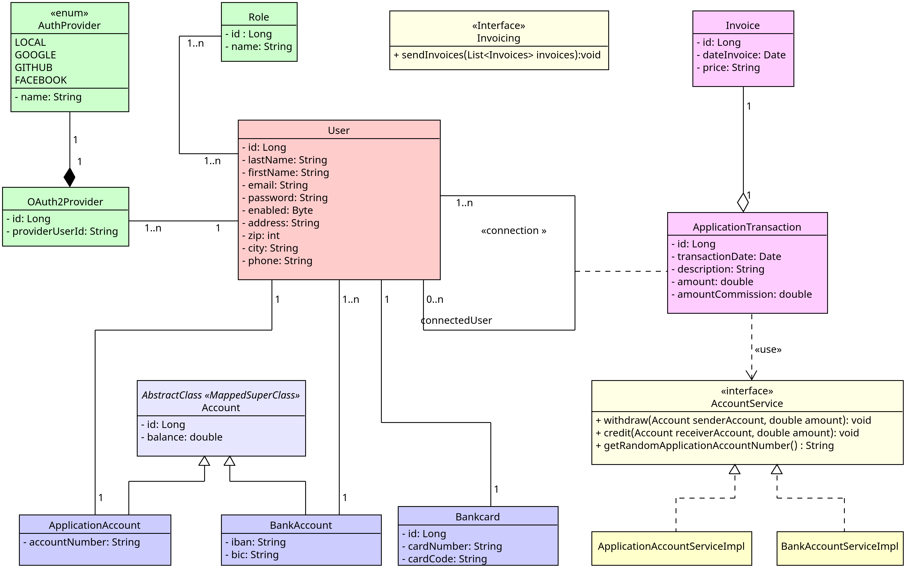

# Paymybuddy

Paymybuddy is a web application that makes easier money transaction between users.
The user connects to the application via Oauht2 or a login and password or registers for the first time. Once connected, he can enter his banking information and immediately make transfers to the accounts of other selected users.

This application was developed with springBoot, springSecurity for back-end and Thymeleaf, Jquery for front-end.
## Classe's diagram & PDM:
Just bellow, you will find the classe's diagram and the PDM (physical data model) with relation ships between tables in db:

<p align="center" width="100%">

</p>


<p align="center" width="100%">

</p>

## Running the application locally

There are several ways to run application on your local machine. One way is to execute the `main` method in the `com.paymybudddy.PayMyBuddyapplication.java` from your IDE.

Alternatively you can use the [Spring Boot Maven plugin](https://docs.spring.io/spring-boot/docs/current/reference/html/build-tool-plugins-maven-plugin.html) like so:

```shell
mvn spring-boot:run
```

## Access and security in application
Since application started, you can access to it with the URL:

```html
https://localhost:8080/
```
Below you can log to it either:

* by registering your personal information 
* by fill in your login and password, if you are allready registred in application
* by using provider like GITHUB, GOOGLE or FACEBOOK with OAuth2 login

<p align="center" width="100%">

</p>


Application uses springsecurity to secure all access to it whether it is by fillin in your login & password or by loging with Oauth2 provider: A role is assigned to each user of the application and each password is registred in bdd with a password encrypter.

For Oauht2 login, I use a CustomOauth2SuccessHandler to verify connection and providers (only 3 provider are accepted , mentioned above).

<p align="center" width="100%">

</p>
All connections were verify with springSecurityTest Framework.


## Run test

We used TDD to implement code in this project:

So, from creation of integration and unit tests, we created the source's code and check it to be sure of its correct working.

* To run unit tests only, you can use command:

```shell
mvn:test
```
* To run integration tests only, you can use command:

```shell
mvn failsafe:integration-test
```
* If you want to launch a build phase without integration tests, you can use next option for example:

```shell
mvn verify -Dskip.it=true
```
## Jacoco Coverage

A report of coverage is automatically done when you launch tests.

you can access to it at location :`target/site/jacoco/index.html`

## Site and Reports

We created a site with Maven to aggregate different reports:

* 	**Source Xref** Html based, cross reference version of Java source code.
* 	**Test Source Xref** Html based, cross reference version of Java test source code.
* 	**SureFire Report** for all unit Tests.
* 	**Jacoco Report** for coverage in Junit Tests.
* 	**Javadoc Report** on src/main/java. 


To deploy the site use the command:

```shell
mvn site
```
and in `target/site` you will find a page index.html that you can open in your web browser witch contains these different reports:

## Application was built with

* `SpringBoot 2.5.4`
* `SpringSecurity 2.5.4`
* `Thymeleaf 2.5.4`
* `ModelMapper 3.1.0`
* `Java 8`
* `Maven 4.0.0`
* `H2 and Mysql databases`
* `JUnit,Mockito,Hamcrest, Assert-Db`
* `SpringSecurityTest 5.5.2`
* `Jacoco`
* `Log4j`

## Versions

* **V1.0.2**	:	correction: delete debugger in profile.html
* **V1.0.1**	:	Second version with correction of bug paging in transfert.html
* **V1.0.0**	:	First version of application with upgrade tests:

